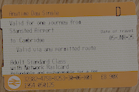

# Permitted Route Calculator

## Motivation

When buying a railway ticket in the UK, chances are that the ticket will said to be ''valid via any permitted route''. **Which** routes are the valid ones though? That can be surprisingly hard to find out. There are three distinct criteria in virtue of which a route can count as valid:

1. It is the route an ''advertised through train'' takes.
2. It is the shortest route between the source and destination.
3. It is neither of the above, but the route is listed in the *National Routing Guide*.

The first criterion sounds complicated but is the most straightforward. If you want to travel from A to B, and a particular route shows up when searching for trains from A to B with [the official journey planner](https://www.nationalrail.co.uk/), then that route is valid.

The second criterion sound easy but is a bit harder to apply. Network Rail provides a [mileages table](https://www.networkrail.co.uk/running-the-railway/the-timetable/electronic-national-rail-timetable/), and the Routing Guide manual suggests to compute the ''throughout distance for travel between every station by any route'' by adding ''mileages together for the component parts of the journey by referring to the relevant timetables''. But helpfully someone has already automated this process and we can thus use the [RailMiles Mileage Engine](https://my.railmiles.me/mileage-engine/).

The third criterion is complicated, because using the [National Routing Guide](https://www.nationalrail.co.uk/travel-information/routeing-guide/) is difficult. In order to get the full list of permitted routes from A to B, one needs to go through up to seven steps:

1. **Routing Points**

A subset of all stations are classified as *routing points*. Using a document called *the pink pages* (a 71 page PDF), we first need to determine whether origin and destination are routing points, and if not, which routing points they are associated with.

2. **Common Routing Points**

Do origin and destination have any routing points in common? If so, then things are straightforward: ''the permitted route is direct via the shortest distance from the origin to the destination over which a regular scheduled passenger train service operates''. (If the stations have *more* than one routing point in common, then the shortest of the possible routes is the permitted one.)

3. **Selecting Appropriate Routing Points**

If origin and destination **don't** have any routing points in common, then we need to select appropriate routing points to determine the valid routes between them. In case origin and destination are asscoated with only a *single* routing point (or *are* routing points), no selection needs to be made and we can move on. But if *several* routing points are associated with one of the stations, then some of them might nevertheless be invalid for a given route, and thus need to be excluded at this step.

In order to determine the appropriateness of routing points, we consult the historic National Fares Manual data from September 1996 (NFM64). A routing point for the origin station is appropriate for the destination only if the fare -- in 1996 -- from that *routing point* to the destination was the same or lower than the fare from *the origin station* to the destination. The same procedure is then applied to the routing points of the destination as well.

Thankfully National Rail provides a [Routing Point Calculator](https://rgpp.iblocks.co.uk/routeing-point-calculator) to helpf with this part of the process.

4. **Routing Codes**

Special case: LONDON

5. **Route Maps**

[Official Maps](https://rgpp.iblocks.co.uk/maps)

[Vail Data Routing Guide](https://vaildata.uk/routeing?map=)

6. **From Station to Routing Point**

In case the stations aren't themselves routing points
''If one station is a routeing point and the other one is a related station, the permitted route is the
shortest route to the routeing point plus the permitted routes between routeing points.
If both are related stations, use the shortest distance to the first routeing point, followed by the
permitted routes between the routeing points, then finally the shortest route from the final
routeing point.''

7. **Easements**

## My implementation

Mention:

- Why several maps instead of one?

# Data Sources

For station locations: https://github.com/davwheat/uk-railway-stations

